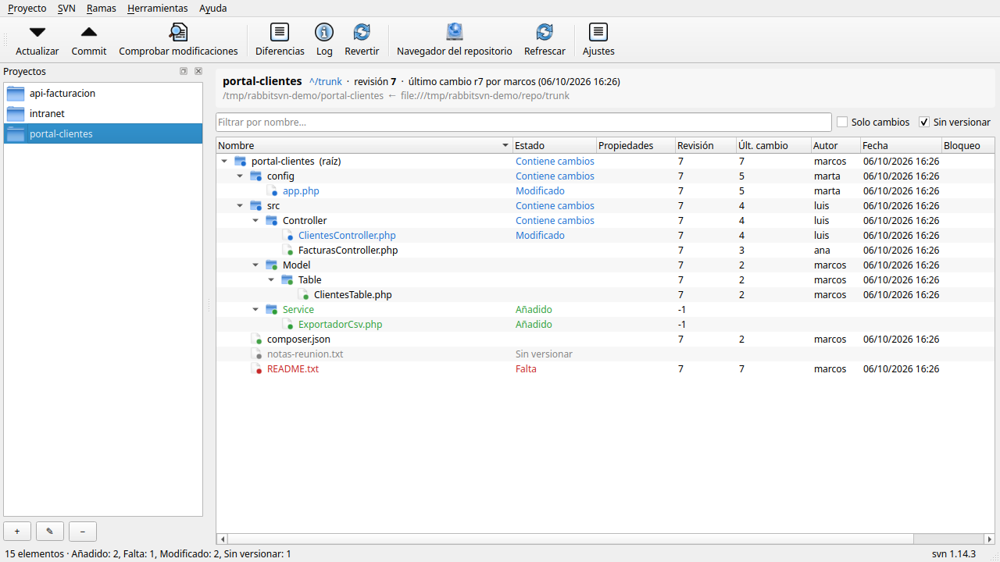
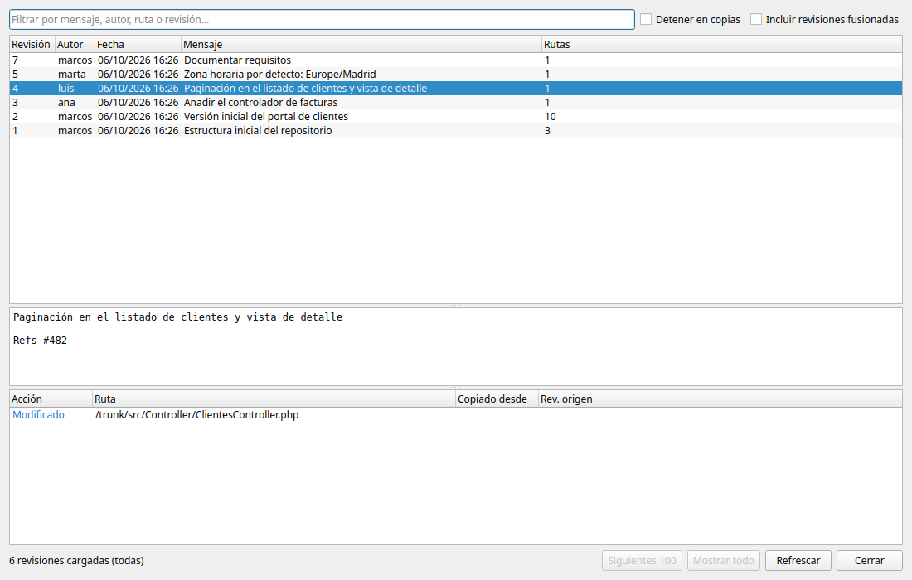
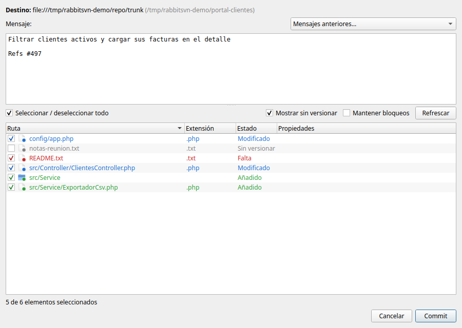
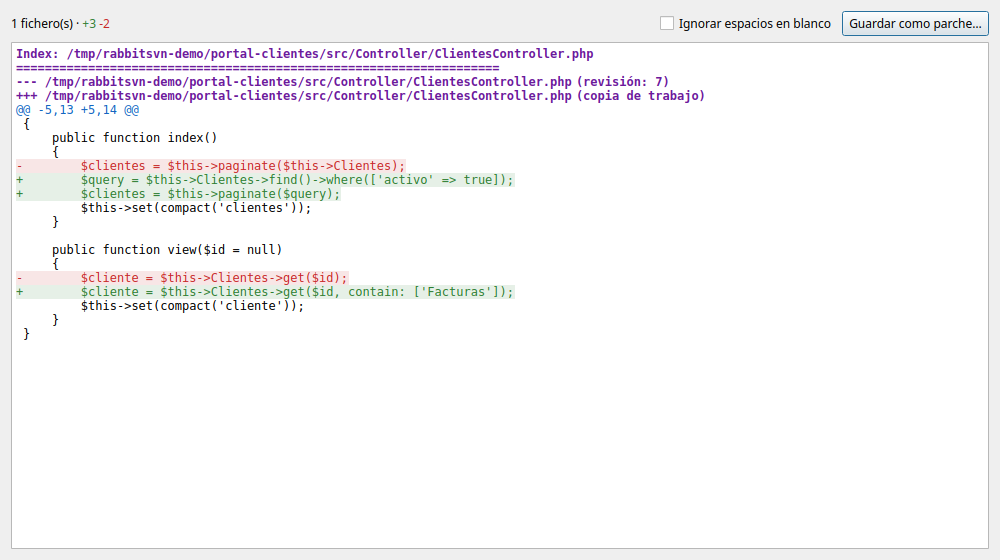
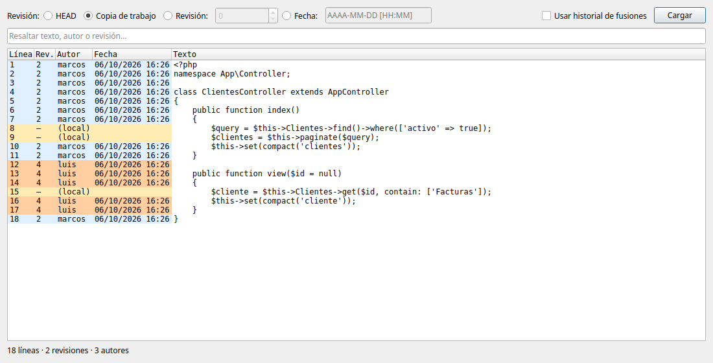
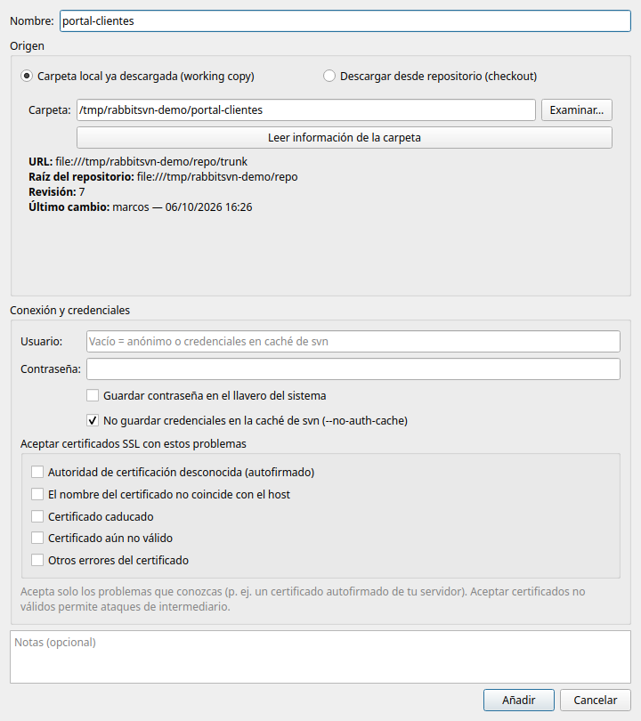
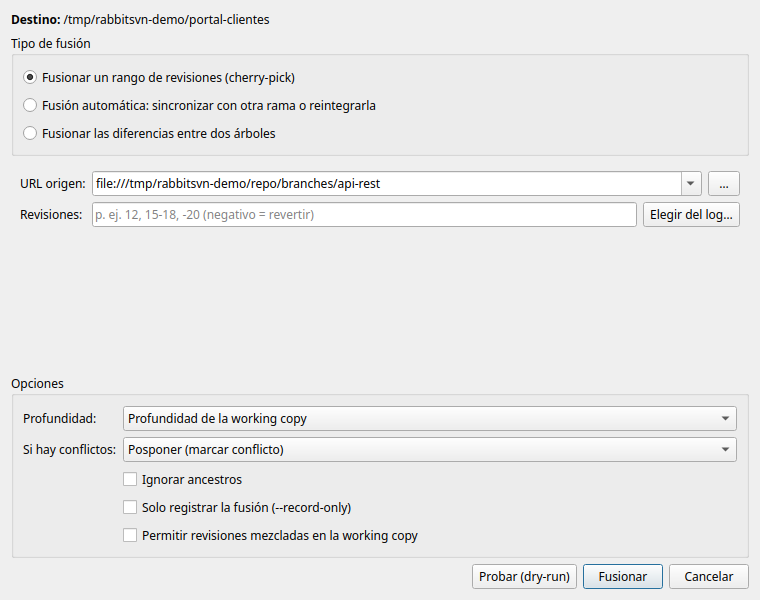
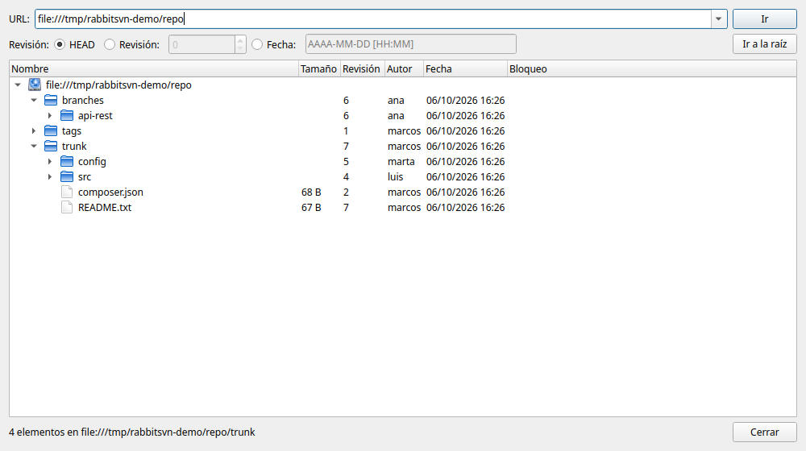
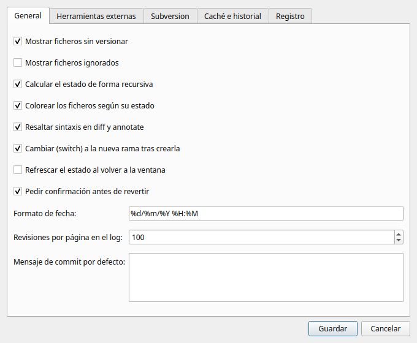

<div align="center">


# RabbitSVN

**Todo Subversion en una sola ventana: commit, log, diff, ramas y fusiones sin pelearte con la terminal.**

[](https://www.python.org/)
[](https://doc.qt.io/qtforpython-6/)
[](https://subversion.apache.org/)
[](#-instalación)
[](LICENSE)
[](https://github.com/mgomezbuceta/rabbit-svn/releases/latest)



</div>

---

## ¿Por qué?

[RabbitVCS](https://github.com/rabbitvcs/rabbitvcs) fue durante años la forma cómoda de usar Subversion en Linux, pero depende de extensiones del gestor de archivos y de `pysvn`, que cada vez cuesta más instalar. **RabbitSVN** recoge todas sus funciones de SVN en una **aplicación independiente**. Tus working copies quedan organizadas como proyectos, cada una con sus credenciales, y ves de un vistazo qué has cambiado.

Por debajo usa el cliente oficial `svn` con salida XML, así que hace exactamente lo mismo que harías en la terminal. **Tus contraseñas nunca salen del llavero del sistema** y no aparecen en la línea de órdenes.

## ✨ Características

| | |
|---|---|
| 🗂️ **Proyectos** | Añade una carpeta que ya sea working copy o haz checkout desde una URL. Cada proyecto guarda usuario, contraseña y opciones SSL. |
| 🌳 **Estado de un vistazo** | Árbol de la working copy con colores por estado (modificado, añadido, eliminado, conflicto, sin versionar…), filtro y vista *Solo cambios*. |
| ✅ **Commit cómodo** | Mensajes recientes, selección de ficheros, añade los no versionados y elimina los que faltan en el mismo paso. |
| 🕓 **Log completo** | Paginado y con filtro. Desde cada revisión: ver cambios, comparar, actualizar a ella, revertirla, fusionarla, crear una rama o editar el autor y el mensaje. |
| 🔍 **Diff y annotate** | Visor interno con resaltado o tu herramienta externa (meld, kdiff3…). Annotate coloreado por antigüedad de cada línea. |
| 🔀 **Ramas y fusiones** | Ramas y etiquetas, switch, merge por rangos (cherry-pick), automático o entre dos árboles, siempre con prueba en seco (*dry-run*). |
| 🌐 **Navegador del repositorio** | Explora cualquier revisión, abre o guarda ficheros, crea, renombra o borra carpetas, y haz checkout o export. |
| 🧰 **Todo lo demás** | Propiedades, ignorar, bloqueos, conflictos, parches, import/export, relocate, cleanup, changelists y crear repositorios. |
| 🔐 **Credenciales seguras** | Contraseñas en el llavero de GNOME o KWallet, enviadas a svn por stdin y nunca escritas en disco ni en `ps`. |
| 🖥️ **Consola** | Muestra cada orden `svn` ejecutada y su salida, para saber siempre qué está pasando. |

<div align="center">


<br>


</div>

## ⚙️ Cómo funciona

```
 Proyecto ──▶ Estado (svn status) ──▶ Acción (commit, update, merge…) ──▶ svn ──▶ Repositorio
 (carpeta +     árbol con colores        diálogo con las opciones           CLI    (file, svn, svn+ssh,
  credenciales)                          y vista previa                            http, https)
```

1. **Organizas**: cada working copy es un proyecto con su URL, su usuario y su contraseña (en el llavero).
2. **Ves**: la ventana principal muestra el estado de todos los ficheros. Las carpetas con cambios dentro se marcan.
3. **Actúas**: los botones y el menú contextual lanzan la orden `svn` que corresponde. La ventana de progreso muestra su salida y se puede cancelar.

RabbitSVN no guarda copia de tus datos: todo lo que ves sale de tu working copy o del repositorio en el momento.

## 📦 Instalación

### Versiones disponibles

| Sistema | Formato | Notas |
|---|---|---|
| 🐧 **Ubuntu 22.04+ / Debian 12+** (x86_64) | `rabbit-svn_<versión>_amd64.deb` | Incluye su propia copia de PySide6. Instala Subversion y el resto de dependencias, y añade la app al menú. |
| 🛠️ **Código fuente** | `./install.sh` | Cualquier Linux con Python 3.10+. Ideal para desarrollar. |

**[⬇️ Descarga la última versión](https://github.com/mgomezbuceta/rabbit-svn/releases/latest)** desde *Releases*. Cada versión incluye `SHA256SUMS.txt` para comprobar la descarga.

### 🐧 Paquete .deb (recomendado)

```bash
sha256sum -c SHA256SUMS.txt                      # opcional: comprobar la descarga
sudo apt install ./rabbit-svn_<versión>_amd64.deb
```

`apt` instala también `subversion` y el resto de dependencias. Después búscala en el menú de aplicaciones como **RabbitSVN**, o escribe `rabbit-svn` en una terminal.

- **Actualizar**: desde la 0.2.0 la app se actualiza sola (ver abajo). También puedes instalar el `.deb` nuevo encima: tu configuración y tus proyectos se conservan.
- **Desinstalar**: `sudo apt remove rabbit-svn`. Tus proyectos y ajustes de `~/.config/rabbit-svn` no se borran.

### 🔄 Actualizaciones automáticas

Con el paquete `.deb` instalado, RabbitSVN consulta la última release de GitHub al arrancar y cada 6 horas. Si hay una versión nueva, muestra sus notas y un botón **Instalar ahora**:

1. Descarga el `.deb` de la release.
2. Comprueba su SHA-256 contra `SHA256SUMS.txt` y contra el digest que publica GitHub, y que el paquete sea `rabbit-svn` con la versión anunciada. Si algo no cuadra, no instala nada.
3. Lo instala con `apt` mediante `pkexec`, que te pide la contraseña con el diálogo del sistema.
4. Te ofrece reiniciar la aplicación.

También puedes elegir *Más tarde* u *Omitir esta versión*, buscar a mano en *Ayuda → Buscar actualizaciones* o desactivarlo en *Ajustes → General*. La comprobación solo hace una petición a la API de GitHub y no envía ningún dato tuyo. Si instalaste desde el código fuente, la app solo te avisa: actualiza con `git pull && ./install.sh`.

> La versión 0.1.x no incluye el actualizador: instala la 0.2.0 a mano una vez y, a partir de ahí, se actualizará sola.

### 🛠️ Desde el código fuente

| | Versión | En Ubuntu / Debian |
|---|---|---|
| 🐍 **Python** | 3.10 o superior, con `venv` | `sudo apt install python3 python3-venv` |
| 📦 **Subversion** | 1.10 o superior | `sudo apt install subversion` |
| 🔍 **meld** *(opcional)* | cualquiera | `sudo apt install meld` |

```bash
git clone https://github.com/mgomezbuceta/rabbit-svn.git
cd rabbit-svn
./install.sh
```

`install.sh` no necesita `sudo`. Hace tres cosas:

- Crea un entorno virtual en `.venv` con las dependencias de `requirements.txt` (PySide6 y keyring, con versiones fijadas).
- Crea el lanzador `~/.local/bin/rabbit-svn`.
- Añade **RabbitSVN** al menú de aplicaciones.

Para usar otro intérprete: `PYTHON=/ruta/a/python3 ./install.sh`.

- **Actualizar**: `git pull && ./install.sh`.
- **Desinstalar**: `rm ~/.local/bin/rabbit-svn ~/.local/share/applications/rabbit-svn.desktop` y borra la carpeta clonada.

> No instales a la vez el `.deb` y la versión del código fuente: los dos crean el comando `rabbit-svn`.

### Arrancar

```bash
rabbit-svn                       # abre el último proyecto usado
rabbit-svn ~/proyectos/mi-wc     # abre (o propone añadir) esa working copy
```

O búscalo en el menú de aplicaciones como **RabbitSVN**. Probado en **Ubuntu 24.04** con Subversion 1.14 y Python 3.12.

> **¿No se abre?** Si lo lanzas desde el menú, los errores de arranque quedan en `~/.config/rabbit-svn/arranque.log`. Lánzalo desde una terminal con `rabbit-svn` para verlos directamente.

## 🚀 Guía rápida

### 1. Añade tu primer proyecto

**Proyecto → Añadir proyecto** (`Ctrl+N`), o arrastra una carpeta a la ventana.

- **Carpeta local ya descargada**: elige la carpeta y pulsa *Leer información de la carpeta*. Se rellenan la URL, la raíz del repositorio y la revisión. Si eliges una subcarpeta, se usa la raíz de la working copy.
- **Descargar desde repositorio (checkout)**: escribe la URL y la carpeta destino. Elige la revisión y la profundidad si lo necesitas. Pulsa *Probar conexión* antes de aceptar.

Rellena el **usuario** y la **contraseña** si el servidor los pide. Marca *Guardar contraseña en el llavero* para no volver a escribirla. Solo si tu servidor usa un certificado autofirmado, marca el problema concreto en *Aceptar certificados SSL*.

<div align="center">

</div>

### 2. Trabaja con la working copy

| Quiero… | Cómo |
|---|---|
| Traer los cambios del servidor | **Actualizar** (`Ctrl+U`). |
| Ver qué he cambiado | Marca **Solo cambios**, o abre **Comprobar modificaciones** (`Ctrl+M`), que también muestra los cambios del repositorio. |
| Ver las diferencias de un fichero | Doble clic sobre él, o **Diferencias** (`Ctrl+D`). |
| Subir mis cambios | **Commit** (`Ctrl+K`): escribe el mensaje, revisa los ficheros marcados y pulsa *Commit*. |
| Deshacer cambios locales | Selecciona → **Revertir**. |
| Ver el historial | **Log** (`Ctrl+L`) sobre la raíz o sobre un fichero. |
| Saber quién cambió cada línea | Clic derecho sobre el fichero → **Annotate**. |
| Ignorar un fichero | Clic derecho → **Ignorar** → por nombre, por extensión o en todas las subcarpetas. |
| Resolver un conflicto | Clic derecho → **Editar conflictos** (abre tu herramienta de fusión) → **Marcar como resuelto**. |

Casi todo está también en el **menú contextual** de cada fichero o carpeta, que solo ofrece las acciones que tienen sentido para lo seleccionado.

### 3. Ramas y fusiones

- **Crear una rama o etiqueta**: menú **Ramas → Crear rama / etiqueta**. Elige la revisión de origen y la URL de destino (el botón `…` abre el navegador del repositorio). Opcionalmente, cambia la working copy a la rama nueva.
- **Cambiar de rama**: **Ramas → Cambiar (switch)**.
- **Fusionar**: **Ramas → Fusionar (merge)**. Indica las revisiones a mano (`12, 15-18, -20`) o elígelas desde el log. Pulsa siempre antes **Probar (dry-run)** para ver qué va a pasar sin tocar nada.

<div align="center">


</div>

### 4. Ajustes

**Herramientas → Ajustes** (`Ctrl+,`):

- **General**: qué ficheros mostrar, colores, formato de fecha, revisiones por página del log y mensaje de commit por defecto.
- **Herramientas externas**: diff, fusión y aplicación para abrir ficheros. El botón *Detectar* busca meld, kdiff3 o kompare.
- **Subversion**: rutas de `svn` y `svnadmin`, tiempo máximo de las consultas y gestión de la caché de credenciales de svn. Avisa si hay contraseñas guardadas en texto plano.
- **Caché e historial** y **Registro**.

<div align="center">

</div>

### Atajos de teclado

| Atajo | Acción | Atajo | Acción |
|---|---|---|---|
| `Ctrl+N` | Añadir proyecto | `Ctrl+L` | Log |
| `Ctrl+U` | Actualizar | `Ctrl+B` | Navegador del repositorio |
| `Ctrl+K` | Commit | `F2` | Renombrar |
| `Ctrl+M` | Comprobar modificaciones | `F5` | Refrescar |
| `Ctrl+D` | Diferencias | `Ctrl+,` | Ajustes |

## 🔐 Seguridad

- **Contraseñas**:
  - Solo en el **llavero del sistema** (Secret Service/GNOME Keyring o KWallet). Se rechazan los backends que guardan en fichero sin cifrar.
  - Si no hay llavero, solo se recuerdan mientras la app está abierta.
  - Al editar un proyecto, la contraseña guardada no se muestra en el formulario.
- **Nada sensible en la línea de órdenes**: la contraseña va a svn por stdin (`--password-from-stdin`). Los mensajes de log van por un fichero temporal 0600, que se borra al terminar.
- **`--no-auth-cache` por defecto**, para que svn no duplique tus credenciales en `~/.subversion`.
- **URLs**: solo `file`, `svn`, `svn+ssh`, `http` y `https`. Las que incluyen `usuario:contraseña@` se rechazan.
- **Certificados SSL**: solo se aceptan los problemas que marques en cada proyecto.
- **Sin inyección de argumentos**:
  - Rutas y URLs van siempre tras `--`.
  - Revisiones y rangos se validan.
  - No se usa shell en ningún punto.
- **Contenido del repositorio tratado como no fiable**:
  - Nombres de fichero saneados.
  - Temporales en carpetas privadas que se borran al salir.
  - Confirmación antes de abrir scripts o ejecutables.
  - Textos del servidor escapados antes de mostrarse.
- **Configuración robusta**:
  - Ficheros 0600 en una carpeta 0700.
  - Escritura atómica y con bloqueo, así que dos ventanas abiertas no se pisan.
  - Si el fichero se corrompe, se conserva una copia en lugar de sobrescribirlo.

### Dónde se guardan tus datos

| Fichero | Contenido |
|---|---|
| `~/.config/rabbit-svn/config.json` | Proyectos, ajustes e historial de URLs y mensajes. **Sin contraseñas.** |
| `~/.config/rabbit-svn/rabbit-svn.log` | Registro (nivel configurable; rota a los 5 MB). |
| Llavero del sistema, servicio `rabbit-svn` | Contraseñas de los proyectos que marques. |

## 🧑‍💻 Desarrollo

```bash
.venv/bin/pip install pytest
.venv/bin/python -m pytest tests          # tests del cliente svn y de seguridad
.venv/bin/python scripts/capturas.py      # regenera las capturas con un repositorio de demostración
packaging/build-deb.sh                    # genera instaladores/rabbit-svn_<versión>_amd64.deb y SHA256SUMS.txt
```

`build-deb.sh` no necesita root (usa `fakeroot`). Descarga la rueda de PySide6-Essentials de la versión fijada en `requirements.txt`, elimina lo que la app no usa (Qt Quick, QML, Designer, herramientas…) y deja el paquete en unos 23 MB. La versión sale de `rabbitsvn/__init__.py`.

### Ramas

- `main`: versiones publicadas.
- `develop`: integración del trabajo en curso.
- `feature/…`, `fix/…`, `docs/…`: una rama por cambio. Sale de `develop` y vuelve a ella mediante pull request.

```
rabbitsvn/svn/   cliente de Subversion (órdenes, validación y lectura del XML)
rabbitsvn/ui/    ventana principal y diálogos (PySide6)
rabbitsvn/config.py  configuración, proyectos y llavero
rabbitsvn/updater.py búsqueda, descarga verificada e instalación de versiones nuevas
packaging/       icono, entrada de menú y generación del .deb
scripts/         utilidades (capturas del README)
tests/           tests contra repositorios file:// temporales
```

### Notas técnicas

- Todas las consultas usan `svn … --xml` y se interpretan con `xml.etree`, rechazando cualquier DTD. Las operaciones largas se ejecutan con `QProcess` y su salida se muestra en vivo.
- Las consultas corren en un `QThreadPool`, así que la interfaz no se bloquea mientras svn trabaja.
- Si el servidor rechaza las credenciales (`E170001`/`E215004`), se piden de nuevo y se reintenta la operación.

### Diferencias con RabbitVCS

- Solo Subversion (sin Git ni Mercurial).
- Es una aplicación independiente: no hay menú contextual ni emblemas dentro de Nautilus o Nemo.
- Usa el cliente `svn` oficial en lugar de `pysvn`.

## 📄 Licencia

Distribuido bajo la licencia [Apache 2.0](LICENSE).

---

<div align="center">

Hecho con 🐇 por **[Marcos Gómez Buceta](https://github.com/mgomezbuceta)**

</div>
